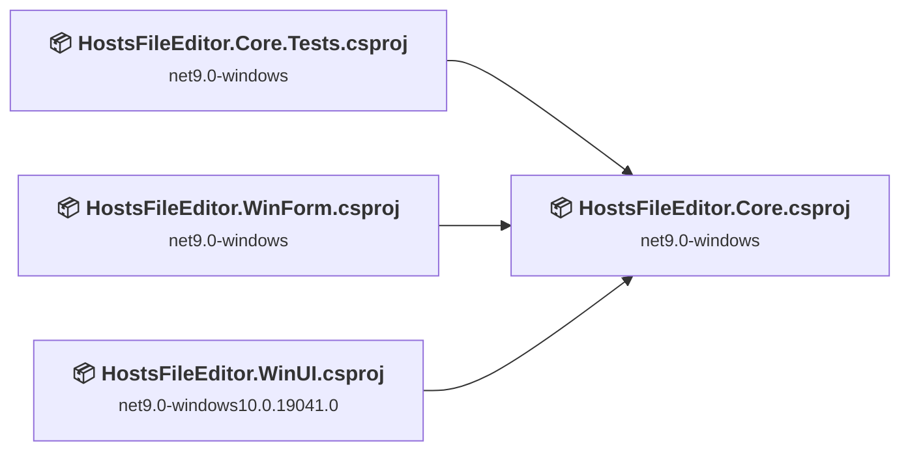
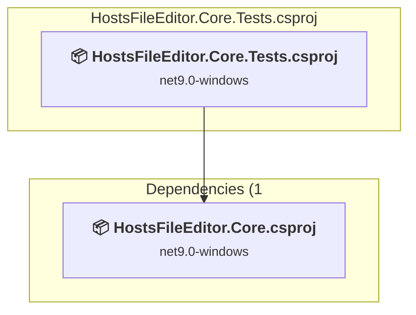
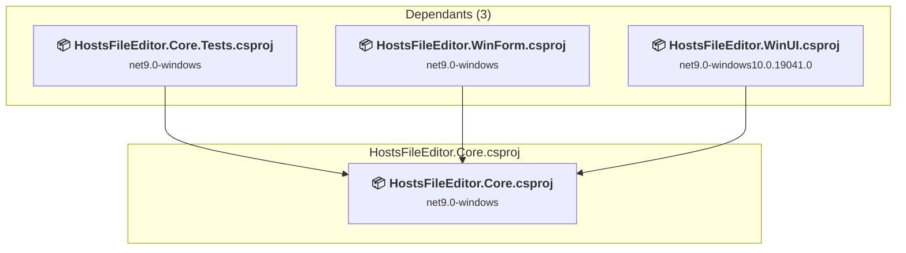
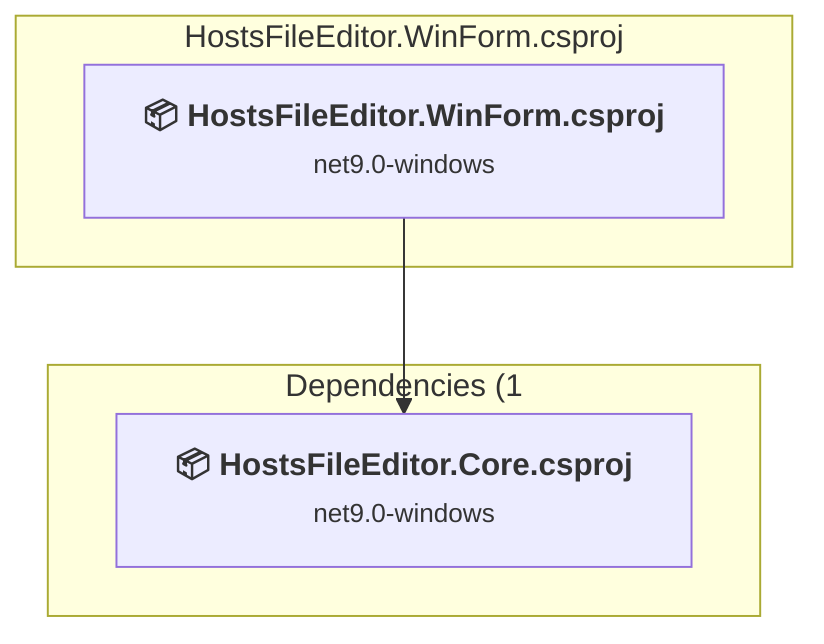
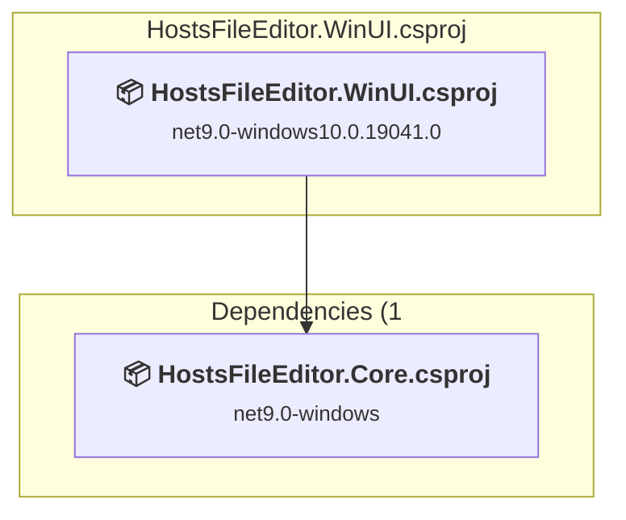

# Projects and dependencies analysis

This document provides a comprehensive overview of the projects and their dependencies in the context of upgrading to .NETCoreApp,Version=v10.0.

## Table of Contents

- [Executive Summary](#executive-Summary)
  - [Highlevel Metrics](#highlevel-metrics)
  - [Projects Compatibility](#projects-compatibility)
  - [Package Compatibility](#package-compatibility)
  - [API Compatibility](#api-compatibility)
- [Aggregate NuGet packages details](#aggregate-nuget-packages-details)
- [Top API Migration Challenges](#top-api-migration-challenges)
  - [Technologies and Features](#technologies-and-features)
  - [Most Frequent API Issues](#most-frequent-api-issues)
- [Projects Relationship Graph](#projects-relationship-graph)
- [Project Details](#project-details)

  - [HostsFileEditor.Core.Tests\HostsFileEditor.Core.Tests.csproj](#hostsfileeditorcoretestshostsfileeditorcoretestscsproj)
  - [HostsFileEditor.Core\HostsFileEditor.Core.csproj](#hostsfileeditorcorehostsfileeditorcorecsproj)
  - [HostsFileEditor.WinForm\HostsFileEditor.WinForm.csproj](#hostsfileeditorwinformhostsfileeditorwinformcsproj)
  - [HostsFileEditor.WinUI\HostsFileEditor.WinUI.csproj](#hostsfileeditorwinuihostsfileeditorwinuicsproj)

## Executive Summary

### Highlevel Metrics

| Metric | Count | Status |
| :--- | :---: | :--- |
| Total Projects | 4 | All require upgrade |
| Total NuGet Packages | 15 | 6 need upgrade |
| Total Code Files | 64 |  |
| Total Code Files with Incidents | 22 |  |
| Total Lines of Code | 8204 |  |
| Total Number of Issues | 2785 |  |
| Estimated LOC to modify | 2774+ | at least 33.8% of codebase |

### Projects Compatibility

| Project | Target Framework | Difficulty | Package Issues | API Issues | Est. LOC Impact | Description |
| :--- | :---: | :---: | :---: | :---: | :---: | :--- |
| [HostsFileEditor.Core.Tests\HostsFileEditor.Core.Tests.csproj](#hostsfileeditorcoretestshostsfileeditorcoretestscsproj) | net9.0-windows | 🟢 Low | 0 | 0 |  | DotNetCoreApp, Sdk Style = True |
| [HostsFileEditor.Core\HostsFileEditor.Core.csproj](#hostsfileeditorcorehostsfileeditorcorecsproj) | net9.0-windows | 🟢 Low | 1 | 2 | 2+ | ClassLibrary, Sdk Style = True |
| [HostsFileEditor.WinForm\HostsFileEditor.WinForm.csproj](#hostsfileeditorwinformhostsfileeditorwinformcsproj) | net9.0-windows | 🟡 Medium | 2 | 2770 | 2770+ | WinForms, Sdk Style = True |
| [HostsFileEditor.WinUI\HostsFileEditor.WinUI.csproj](#hostsfileeditorwinuihostsfileeditorwinuicsproj) | net9.0-windows10.0.19041.0 | 🟢 Low | 4 | 2 | 2+ | WinForms, Sdk Style = True |

### Package Compatibility

| Status | Count | Percentage |
| :--- | :---: | :---: |
| ✅ Compatible | 9 | 60.0% |
| ⚠️ Incompatible | 2 | 13.3% |
| 🔄 Upgrade Recommended | 4 | 26.7% |
| ***Total NuGet Packages*** | ***15*** | ***100%*** |

### API Compatibility

| Category | Count | Impact |
| :--- | :---: | :--- |
| 🔴 Binary Incompatible | 2589 | High - Require code changes |
| 🟡 Source Incompatible | 185 | Medium - Needs re-compilation and potential conflicting API error fixing |
| 🔵 Behavioral change | 0 | Low - Behavioral changes that may require testing at runtime |
| ✅ Compatible | 8898 |  |
| ***Total APIs Analyzed*** | ***11672*** |  |

## Aggregate NuGet packages details

| Package | Current Version | Suggested Version | Projects | Description |
| :--- | :---: | :---: | :--- | :--- |
| 7ZipCLI | 9.20.0 |  | [HostsFileEditor.WinForm.csproj](#hostsfileeditorwinformhostsfileeditorwinformcsproj) | ✅Compatible |
| coverlet.collector | 6.0.0 |  | [HostsFileEditor.Core.Tests.csproj](#hostsfileeditorcoretestshostsfileeditorcoretestscsproj) | ✅Compatible |
| Equin.ApplicationFramework.BindingListView | 1.4.5222.35545 |  | [HostsFileEditor.WinForm.csproj](#hostsfileeditorwinformhostsfileeditorwinformcsproj) | ⚠️NuGet package is incompatible |
| H.NotifyIcon.WinUI | 2.3.0 |  | [HostsFileEditor.WinUI.csproj](#hostsfileeditorwinuihostsfileeditorwinuicsproj) | ⚠️NuGet package is incompatible |
| Microsoft.CSharp | 4.7.0 |  | [HostsFileEditor.WinForm.csproj](#hostsfileeditorwinformhostsfileeditorwinformcsproj) | ✅Compatible |
| Microsoft.Extensions.DependencyInjection | 9.0.9 | 10.0.8 | [HostsFileEditor.WinUI.csproj](#hostsfileeditorwinuihostsfileeditorwinuicsproj) | NuGet package upgrade is recommended |
| Microsoft.NET.Test.SDK | 17.14.1 |  | [HostsFileEditor.Core.Tests.csproj](#hostsfileeditorcoretestshostsfileeditorcoretestscsproj) | ✅Compatible |
| Microsoft.WindowsAppSDK | 1.8.250916003 |  | [HostsFileEditor.WinUI.csproj](#hostsfileeditorwinuihostsfileeditorwinuicsproj) | ✅Compatible |
| MSTest.TestAdapter | 3.11.0 |  | [HostsFileEditor.Core.Tests.csproj](#hostsfileeditorcoretestshostsfileeditorcoretestscsproj) | ✅Compatible |
| MSTest.TestFramework | 3.11.0 |  | [HostsFileEditor.Core.Tests.csproj](#hostsfileeditorcoretestshostsfileeditorcoretestscsproj) | ✅Compatible |
| Shouldly | 4.2.1 |  | [HostsFileEditor.Core.Tests.csproj](#hostsfileeditorcoretestshostsfileeditorcoretestscsproj) | ✅Compatible |
| System.Resources.Extensions | 9.0.8 | 10.0.8 | [HostsFileEditor.Core.csproj](#hostsfileeditorcorehostsfileeditorcorecsproj) | NuGet package upgrade is recommended |
| System.Resources.Extensions | 9.0.9 | 10.0.8 | [HostsFileEditor.WinUI.csproj](#hostsfileeditorwinuihostsfileeditorwinuicsproj) | NuGet package upgrade is recommended |
| System.Resources.ResourceManager | 4.3.0 |  | [HostsFileEditor.WinForm.csproj](#hostsfileeditorwinformhostsfileeditorwinformcsproj) | NuGet package functionality is included with framework reference |
| System.Text.Json | 9.0.9 | 10.0.8 | [HostsFileEditor.WinUI.csproj](#hostsfileeditorwinuihostsfileeditorwinuicsproj) | NuGet package upgrade is recommended |

## Top API Migration Challenges

### Technologies and Features

| Technology | Issues | Percentage | Migration Path |
| :--- | :---: | :---: | :--- |
| Windows Forms | 2589 | 93.3% | Windows Forms APIs for building Windows desktop applications with traditional Forms-based UI that are available in .NET on Windows. Enable Windows Desktop support: Option 1 (Recommended): Target net9.0-windows; Option 2: Add <UseWindowsDesktop>true</UseWindowsDesktop>; Option 3 (Legacy): Use Microsoft.NET.Sdk.WindowsDesktop SDK. |
| Windows Forms Legacy Controls | 350 | 12.6% | Legacy Windows Forms controls that have been removed from .NET Core/5+ including StatusBar, DataGrid, ContextMenu, MainMenu, MenuItem, and ToolBar. These controls were replaced by more modern alternatives. Use ToolStrip, MenuStrip, ContextMenuStrip, and DataGridView instead. |
| GDI+ / System.Drawing | 164 | 5.9% | System.Drawing APIs for 2D graphics, imaging, and printing that are available via NuGet package System.Drawing.Common. Note: Not recommended for server scenarios due to Windows dependencies; consider cross-platform alternatives like SkiaSharp or ImageSharp for new code. |
| Legacy Configuration System | 17 | 0.6% | Legacy XML-based configuration system (app.config/web.config) that has been replaced by a more flexible configuration model in .NET Core. The old system was rigid and XML-based. Migrate to Microsoft.Extensions.Configuration with JSON/environment variables; use System.Configuration.ConfigurationManager NuGet package as interim bridge if needed. |

### Most Frequent API Issues

| API | Count | Percentage | Category |
| :--- | :---: | :---: | :--- |
| T:System.Windows.Forms.ToolStripMenuItem | 406 | 14.6% | Binary Incompatible |
| P:System.Windows.Forms.ToolStripItem.Name | 101 | 3.6% | Binary Incompatible |
| T:System.Drawing.Bitmap | 96 | 3.5% | Source Incompatible |
| T:System.Windows.Forms.ToolStripButton | 91 | 3.3% | Binary Incompatible |
| T:System.Windows.Forms.ToolStripSeparator | 85 | 3.1% | Binary Incompatible |
| T:System.Windows.Forms.Label | 57 | 2.1% | Binary Incompatible |
| T:System.Windows.Forms.DataGridViewTextBoxColumn | 56 | 2.0% | Binary Incompatible |
| E:System.Windows.Forms.ToolStripItem.Click | 52 | 1.9% | Binary Incompatible |
| M:System.Windows.Forms.ToolStripMenuItem.#ctor | 50 | 1.8% | Binary Incompatible |
| T:System.Drawing.Image | 45 | 1.6% | Source Incompatible |
| P:System.Windows.Forms.ToolStripItem.Image | 44 | 1.6% | Binary Incompatible |
| T:System.Windows.Forms.Button | 42 | 1.5% | Binary Incompatible |
| M:System.Windows.Forms.ToolStripSeparator.#ctor | 34 | 1.2% | Binary Incompatible |
| T:System.Windows.Forms.BindingSource | 32 | 1.2% | Binary Incompatible |
| T:System.Windows.Forms.TextBox | 30 | 1.1% | Binary Incompatible |
| T:System.Windows.Forms.TableLayoutPanel | 30 | 1.1% | Binary Incompatible |
| T:System.Windows.Forms.Keys | 27 | 1.0% | Binary Incompatible |
| T:System.Windows.Forms.DialogResult | 26 | 0.9% | Binary Incompatible |
| P:System.Windows.Forms.Control.Name | 25 | 0.9% | Binary Incompatible |
| T:System.Windows.Forms.SplitContainer | 23 | 0.8% | Binary Incompatible |
| T:System.Windows.Forms.FormWindowState | 22 | 0.8% | Binary Incompatible |
| T:System.Windows.Forms.AnchorStyles | 22 | 0.8% | Binary Incompatible |
| T:System.Windows.Forms.ToolStripContainer | 22 | 0.8% | Binary Incompatible |
| T:System.Windows.Forms.ContextMenuStrip | 20 | 0.7% | Binary Incompatible |
| T:System.Windows.Forms.ToolStripStatusLabel | 18 | 0.6% | Binary Incompatible |
| T:System.Windows.Forms.DataGridViewCheckBoxColumn | 18 | 0.6% | Binary Incompatible |
| T:System.Windows.Forms.DockStyle | 18 | 0.6% | Binary Incompatible |
| T:System.Windows.Forms.Padding | 17 | 0.6% | Binary Incompatible |
| M:System.Windows.Forms.Control.ResumeLayout(System.Boolean) | 17 | 0.6% | Binary Incompatible |
| M:System.Windows.Forms.Control.SuspendLayout | 17 | 0.6% | Binary Incompatible |
| T:System.Windows.Forms.SizeType | 16 | 0.6% | Binary Incompatible |
| T:System.Windows.Forms.ToolStripItemDisplayStyle | 15 | 0.5% | Binary Incompatible |
| P:System.Windows.Forms.ToolStripMenuItem.Checked | 15 | 0.5% | Binary Incompatible |
| T:System.Windows.Forms.DataGridViewAutoSizeColumnMode | 15 | 0.5% | Binary Incompatible |
| P:System.Windows.Forms.ToolStripMenuItem.ShortcutKeys | 15 | 0.5% | Binary Incompatible |
| T:System.Windows.Forms.PictureBox | 15 | 0.5% | Binary Incompatible |
| P:System.Configuration.ApplicationSettingsBase.Item(System.String) | 14 | 0.5% | Source Incompatible |
| T:System.Windows.Forms.LinkLabel | 14 | 0.5% | Binary Incompatible |
| T:System.Windows.Forms.BindingContext | 13 | 0.5% | Binary Incompatible |
| T:System.Windows.Forms.ToolStripItemCollection | 13 | 0.5% | Binary Incompatible |
| T:System.Windows.Forms.Control.ControlCollection | 13 | 0.5% | Binary Incompatible |
| P:System.Windows.Forms.Control.Controls | 13 | 0.5% | Binary Incompatible |
| M:System.Windows.Forms.Control.ControlCollection.Add(System.Windows.Forms.Control) | 13 | 0.5% | Binary Incompatible |
| T:System.Windows.Forms.ToolStrip | 12 | 0.4% | Binary Incompatible |
| P:System.Windows.Forms.Label.Text | 12 | 0.4% | Binary Incompatible |
| P:System.Windows.Forms.Control.Size | 12 | 0.4% | Binary Incompatible |
| P:System.Windows.Forms.Control.Location | 12 | 0.4% | Binary Incompatible |
| M:System.Windows.Forms.ToolStripItemCollection.AddRange(System.Windows.Forms.ToolStripItem[]) | 12 | 0.4% | Binary Incompatible |
| T:System.Windows.Forms.ControlBindingsCollection | 11 | 0.4% | Binary Incompatible |
| P:System.Windows.Forms.Control.TabIndex | 11 | 0.4% | Binary Incompatible |

## Projects Relationship Graph

Legend:
📦 SDK-style project
⚙️ Classic project

## Project Details

### HostsFileEditor.Core.Tests\HostsFileEditor.Core.Tests.csproj

#### Project Info

- **Current Target Framework:** net9.0-windows
- **Proposed Target Framework:** net10.0--windows
- **SDK-style**: True
- **Project Kind:** DotNetCoreApp
- **Dependencies**: 1
- **Dependants**: 0
- **Number of Files**: 20
- **Number of Files with Incidents**: 1
- **Lines of Code**: 881
- **Estimated LOC to modify**: 0+ (at least 0.0% of the project)

#### Dependency Graph

Legend:
📦 SDK-style project
⚙️ Classic project

### API Compatibility

| Category | Count | Impact |
| :--- | :---: | :--- |
| 🔴 Binary Incompatible | 0 | High - Require code changes |
| 🟡 Source Incompatible | 0 | Medium - Needs re-compilation and potential conflicting API error fixing |
| 🔵 Behavioral change | 0 | Low - Behavioral changes that may require testing at runtime |
| ✅ Compatible | 1201 |  |
| ***Total APIs Analyzed*** | ***1201*** |  |

### HostsFileEditor.Core\HostsFileEditor.Core.csproj

#### Project Info

- **Current Target Framework:** net9.0-windows
- **Proposed Target Framework:** net10.0--windows
- **SDK-style**: True
- **Project Kind:** ClassLibrary
- **Dependencies**: 0
- **Dependants**: 3
- **Number of Files**: 17
- **Number of Files with Incidents**: 2
- **Lines of Code**: 1660
- **Estimated LOC to modify**: 2+ (at least 0.1% of the project)

#### Dependency Graph

Legend:
📦 SDK-style project
⚙️ Classic project

### API Compatibility

| Category | Count | Impact |
| :--- | :---: | :--- |
| 🔴 Binary Incompatible | 0 | High - Require code changes |
| 🟡 Source Incompatible | 2 | Medium - Needs re-compilation and potential conflicting API error fixing |
| 🔵 Behavioral change | 0 | Low - Behavioral changes that may require testing at runtime |
| ✅ Compatible | 2149 |  |
| ***Total APIs Analyzed*** | ***2151*** |  |

### HostsFileEditor.WinForm\HostsFileEditor.WinForm.csproj

#### Project Info

- **Current Target Framework:** net9.0-windows
- **Proposed Target Framework:** net10.0-windows
- **SDK-style**: True
- **Project Kind:** WinForms
- **Dependencies**: 1
- **Dependants**: 0
- **Number of Files**: 27
- **Number of Files with Incidents**: 17
- **Lines of Code**: 4051
- **Estimated LOC to modify**: 2770+ (at least 68.4% of the project)

#### Dependency Graph

Legend:
📦 SDK-style project
⚙️ Classic project

### API Compatibility

| Category | Count | Impact |
| :--- | :---: | :--- |
| 🔴 Binary Incompatible | 2589 | High - Require code changes |
| 🟡 Source Incompatible | 181 | Medium - Needs re-compilation and potential conflicting API error fixing |
| 🔵 Behavioral change | 0 | Low - Behavioral changes that may require testing at runtime |
| ✅ Compatible | 3749 |  |
| ***Total APIs Analyzed*** | ***6519*** |  |

#### Project Technologies and Features

| Technology | Issues | Percentage | Migration Path |
| :--- | :---: | :---: | :--- |
| Legacy Configuration System | 17 | 0.6% | Legacy XML-based configuration system (app.config/web.config) that has been replaced by a more flexible configuration model in .NET Core. The old system was rigid and XML-based. Migrate to Microsoft.Extensions.Configuration with JSON/environment variables; use System.Configuration.ConfigurationManager NuGet package as interim bridge if needed. |
| Windows Forms Legacy Controls | 350 | 12.6% | Legacy Windows Forms controls that have been removed from .NET Core/5+ including StatusBar, DataGrid, ContextMenu, MainMenu, MenuItem, and ToolBar. These controls were replaced by more modern alternatives. Use ToolStrip, MenuStrip, ContextMenuStrip, and DataGridView instead. |
| GDI+ / System.Drawing | 164 | 5.9% | System.Drawing APIs for 2D graphics, imaging, and printing that are available via NuGet package System.Drawing.Common. Note: Not recommended for server scenarios due to Windows dependencies; consider cross-platform alternatives like SkiaSharp or ImageSharp for new code. |
| Windows Forms | 2589 | 93.5% | Windows Forms APIs for building Windows desktop applications with traditional Forms-based UI that are available in .NET on Windows. Enable Windows Desktop support: Option 1 (Recommended): Target net9.0-windows; Option 2: Add <UseWindowsDesktop>true</UseWindowsDesktop>; Option 3 (Legacy): Use Microsoft.NET.Sdk.WindowsDesktop SDK. |

### HostsFileEditor.WinUI\HostsFileEditor.WinUI.csproj

#### Project Info

- **Current Target Framework:** net9.0-windows10.0.19041.0
- **Proposed Target Framework:** net10.0-windows10.0.22000.0
- **SDK-style**: True
- **Project Kind:** WinForms
- **Dependencies**: 1
- **Dependants**: 0
- **Number of Files**: 22
- **Number of Files with Incidents**: 2
- **Lines of Code**: 1612
- **Estimated LOC to modify**: 2+ (at least 0.1% of the project)

#### Dependency Graph

Legend:
📦 SDK-style project
⚙️ Classic project

### API Compatibility

| Category | Count | Impact |
| :--- | :---: | :--- |
| 🔴 Binary Incompatible | 0 | High - Require code changes |
| 🟡 Source Incompatible | 2 | Medium - Needs re-compilation and potential conflicting API error fixing |
| 🔵 Behavioral change | 0 | Low - Behavioral changes that may require testing at runtime |
| ✅ Compatible | 1799 |  |
| ***Total APIs Analyzed*** | ***1801*** |  |

